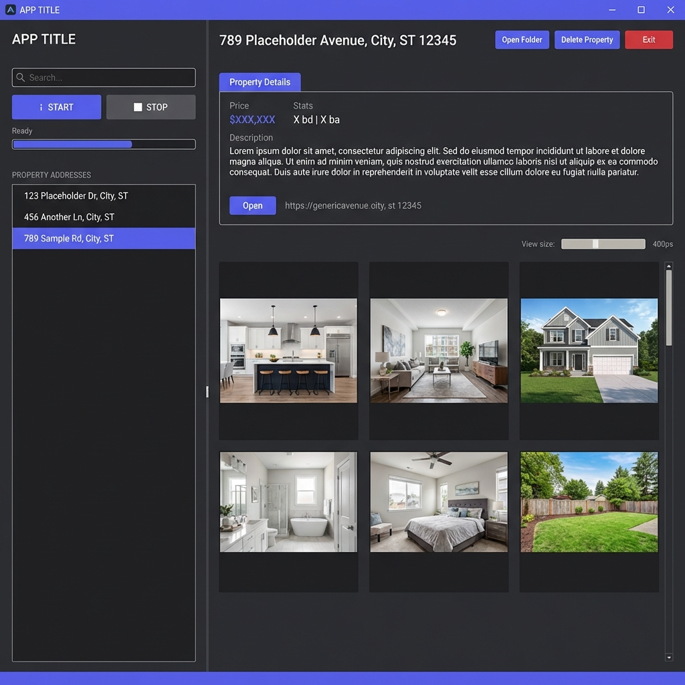

# Tonys Redfin Zillow Image Downloader v1.8.0

A high-performance tool designed to capture high-res photos from Redfin and Zillow listings instantly. Featuring a sleek dark theme, multi-threaded downloading, and automatic property metadata extraction.



### Key Features:
- **Lightning Fast**: Multi-threaded engine downloads up to 10 images simultaneously.
- **Smart Metadata**: Automatically scrapes Price, Beds, Baths, Sq Ft, and Descriptions.
- **Auto-Updates**: One-click updates and restarts directly from GitHub releases.
- **Built-in Gallery**: Browse your downloads and manage property folders within the app.
- **Dynamic View**: Adjustable thumbnail sizes and high-DPI support for crisp viewing.

### How to use it:

**Windows:**
1.  **Clone the repo**: 
    ```bash
    git clone https://github.com/BigTonyTones/Tonys-Redfin-Zillow-Image-Downloader.git
    cd Tonys-Redfin-Zillow-Image-Downloader
    ```
2.  **Run**: Double-click `Start.bat`
3.  **Paste**: Put a Redfin or Zillow link in the box and hit Download.
4.  **Browse**: Click a property in your library on the left to see the photos.

**Linux/Mac:**
1.  **Clone the repo**: 
    ```bash
    git clone https://github.com/BigTonyTones/Tonys-Redfin-Zillow-Image-Downloader.git
    cd Tonys-Redfin-Zillow-Image-Downloader
    ```
2.  **Make executable**: `chmod +x startup.sh`
3.  **Run**: `./startup.sh`
4.  **Paste**: Put a Redfin or Zillow link in the box and hit Download.
5.  **Browse**: Click a property in your library on the left to see the photos.

### Requirements:
Requires Python 3. The app will help you install the other stuff (`requests`, `beautifulsoup4`, `Pillow`) if you don't have them yet.

---
*Created by Tony*
